# Cocreate User Guide

Welcome to Cocreate!  Cocreate is a web-based shared whiteboard tool for
drawing, teaching, and brainstorming.  It's intended to work well both
by yourself and working live with others (e.g., in a video conference).
See [the feature list](https://github.com/edemaine/cocreate/#features)
for a high-level overview.

<!-- markdownlint-disable line-length -->

## Getting Started

To get started, you need

* a device (computer, tablet, or phone,
  equipped with mouse, pen, and/or touchscreen); and
* a modern web browser (we recommend
  [Google Chrome](https://www.google.com/chrome/) as it's the most tested).

Then open Cocreate in the browser:

* If you've been given a link to a Cocreate room,
  just open that link and you should enter the room.
* If you're currently in Cocreate and  want to make a new Cocreate room,
  you can click on the
  [ New Room button](#-new-room).
* If you want to create a new Cocreate room from scratch, go to the root URL
  of your Cocreate server (which should look something like
  `https://cocreate.your.domain/`) and you'll be put into a fresh room
  (with URL something like `https://cocreate.your.domain/r/gLoBaLlYuNiQuEiD7`).
* If you want to share the room you're in with others, click the
  [ Copy Link button](#-copy-link)
  to copy the URL to your clipboard (or select and copy it
  from the URL bar at the top of your browser), then paste it into your
  favorite messaging platform (e.g., email).

Note that *anyone you send the room link to will be able to draw on your
board, delete and edit objects, etc.*
You should not share your room link with anyone malicious
or publicly on the Internet.
This is also why room URLs are randomly generated with 101 bits of entropy,
so that they are extremely difficult to guess.
(In case you have problems, past versions of your boards are always available
in the
[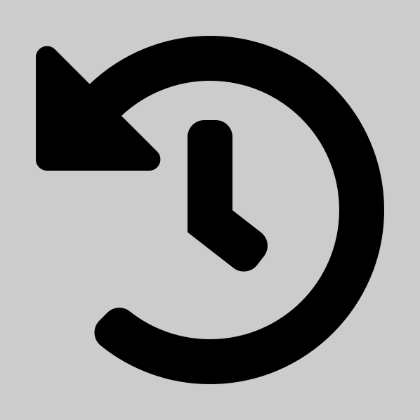 Time Travel view](#-time-travel).)

## User Interface


Most of the Cocreate window is taken up by the page where you can draw.
In addition to your own cursor, you'll see the cursors of anyone else
connected to the board, live as they move their cursor.
This is extremely useful for pointing at things while discussing them.
You can see what tool they're using and (for drawing tools) what color
they're using, so you can use colors as a makeshift way to identify
each other's cursors in a group meeting.

On the left, top, and bottom sides of the Cocreate window, you'll see three
different "palettes" of tools:

* [Main Tools (left palette)](#main-tools-left-palette)
* [Page Tools (top palette)](#page-tools-top-palette)
* [Attribute Tools (bottom palette)](#attribute-tools-bottom-palette)

Hovering your mouse or pen over these tools (or holding your finger on them)
brings up a helpful tooltip explaining what the tool does, how it works,
and any keyboard shortcuts.
In the rest of this guide, we give more detail on each tool.

## Main Tools (left palette)

### 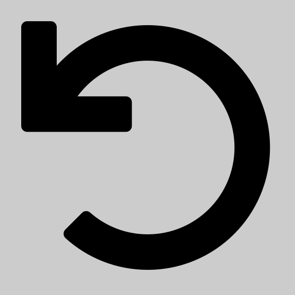 Undo / 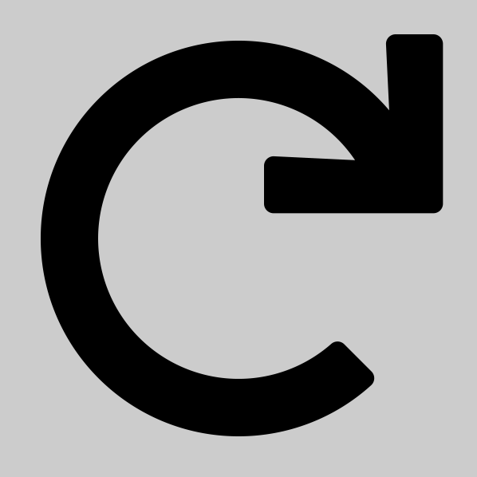 Redo

Undo/redo are familiar options in most software, and their meaning is clear
enough when you're working by yourself.  Conceptually, there's an undo stack
of the operations you've performed since starting Cocreate, and
 Undo will
walk those operations back by doing the inverse operations:
deleting a previously drawn object, putting back a deleted object,
or changing the color back to what it used to be.
Undo is an easy way to fix a mistake: if you didn't like
the stroke you drew, just undo it and try again.

Conversely, if you undid too much,
 Redo
will undo the effect of the last undo operation:
putting the drawn object back, deleting the object again, or
changing the color back again.
Repeatedly undoing and redoing a change is a simple way to demonstrate a
before and after picture too.
But be careful: as soon as you do any operation that's not undo or redo
(like drawing), you can no longer redo undo operations.
Conceptually, you're maintaining a linear timeline of operations,
and you can go back into the past via undo,
and go back to the future via redo,
but once you make a change,
you're on a new timeline and can't get back.

How does this work with multiple people drawing at once?
Cocreate maintains a linear timeline for the entire drawing that is an
interleaving of all the users' operations, so that everyone sees the same
picture.
But undo and redo only apply to your *own* operations;
you can't undo someone else's changes.  (It would be pretty annoying if
you're about to undo your drawing, but then someone else draws something,
and you undo their drawing instead.)
So undo and redo are implemented by *adding* the inverse of your operations
to the *end* of the timeline.
Undoing a drawing operation is simulated by deleting that drawn object;
redoing that undo is simulated by inserting the object again.
You can see this result by playing with the
[ Time Travel tool](#-time-travel).

This usually works fine, but there are exceptions.  If you draw an object,
and someone else deletes it, and then you undo the draw operation, then
you'll attempt to delete it again.  Nothing bad will happen, but you'll
get an error message in the [JavaScript console](#troubleshooting).
If you draw an object, someone edits it (e.g. changes the color),
and you undo and redo drawing the object,
then you get the original object and the edit is lost.
There are some other edge cases when two people are editing the same
object, but usually it all works fine.

###  Pan Tool

The Pan Tool is the first "mode" in the list:
you can be in only one mode at once.
It's also the mode that Cocreate starts in
(because it can't accidentally do anything, so is a safe starting point).
This tool does one thing: scroll around the page.
To use it, drag the page as you would a physical piece of paper,
and it moves around as you'd expect.

Panning is special because it's accessible in any mode (if you have a keyboard)
by holding down the <kbd>Space</kbd> key and then dragging the page.
(This behavior matches Adobe Creative Suite.)

A scroll wheel or a touchpad's scroll gesture (typically
two-finger dragging) also pans the canvas.

Related, if you want to zoom into or out of the page, check out the
[ Zoom Out /
 Zoom In buttons](#-zoom-out---zoom-in).
You can also zoom using a scroll wheel while holding <kbd>Ctrl</kbd>,
or using a touchpad's zoom gesture (typically two-finger pinching).

### 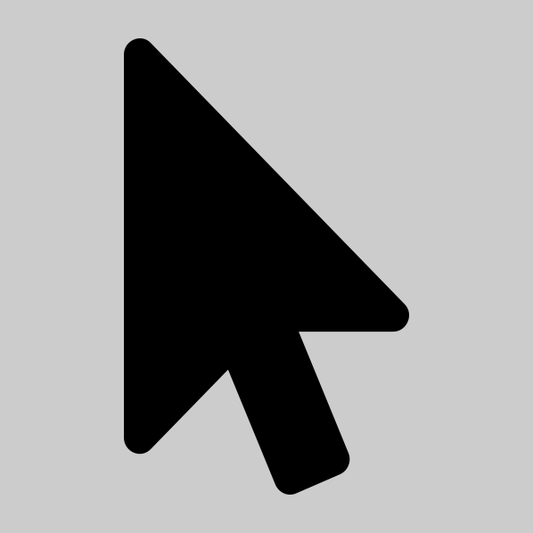 Select Tool

The Select Tool is the second "mode": you can be in only one mode at once.
In general, it lets you manipulate existing drawn objects:
you can move, duplicate, delete, or change color/thickness.

**Selecting objects directly.**
If you hover over an object (with mouse or pen),
you will see it "highlight" in the form of a shadow.
If you click/tap an object, it will get an even darker shadow
to indicate that it's currently selected.
If you click/tap on another object,
the previous object will normally be deselected.
But if you hold down <kbd>Shift</kbd> while clicking/tapping,
then the object you select will toggle in/out of the selection.
This method is good for selecting a specific object (or a few),
but it gets tedious if you want to manipulate several objects at once.

**Rectangular selection.**
If you click/tap and hold on a spot without an object, and then drag,
you create a selection rectangle.
When you let go, any object intersected by the rectangle will get selected.
This is a great way to select many objects at once, and is often convenient
even for selecting a simple object using less precision.
You can select more objects with multiple rectangles by holding
<kbd>Shift</kbd>; each time an object is intersected by a selection rectangle,
it toggles in/out of the selection.

**Attributes.**
When you select one or more objects, your current
[attributes](#attribute-tools-bottom-palette) will update to match those
objects, when their corresponding attributes are all the same.
For example, if you select a filled-blue outlined-green width-5 rectangle,
your fill color will change to blue (and fill will turn on), your outline
color will change to green, and your line width will change to 5.
If you select two objects with line width 3, then your line width will change
to 3; but if you simultaneously select one object with line width 3 and
another object with line width 5, then your line width won't change.
This feature makes it easy to inspect an object's attributes
(just select it to see what they are) and makes it easy to draw more objects
in a similar style (select then draw).

**Editing objects.**

* To change the selected objects' **line width**,
  just click/tap the desired line width.
* To change the selected objects' **outline color**,
  just click/tap the desired color.
* To change the selected objects' **fill color**,
  hold <kbd>Shift</kbd> and click/tap the desired color.

**Moving objects.**
To move the selected objects, click/tap and hold on one of the objects
in the selection and drag it a nontrivial distance.
(It's important to start the drag on one of the existing objects, or else
you'll lose your selection and get a fresh selection rectangle instead.
If you're using a mouse or pen with hover detection, make sure a suitable
object highlights before dragging.)

If you hold <kbd>Shift</kbd> while dragging, the move is constrained to be
purely horizontal or vertical.

**Duplicating objects.**
If you have a keyboard, you can duplicate the selected objects by
<kbd>Ctrl-D</kbd> or <kbd>Command-D</kbd> on a Mac.

**Deleting objects.**
If you have a keyboard, you can delete the selected objects by
pressing the <kbd>Delete</kbd> or <kbd>Backspace</kbd> key.
Otherwise, check out the
[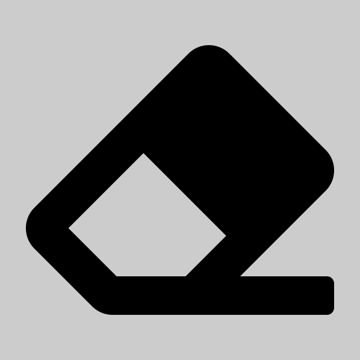 Erase Tool](#-erase-tool).

### 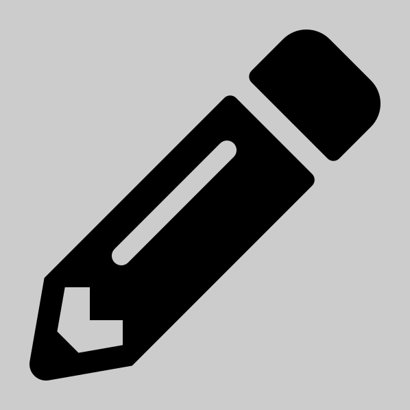 Pen Tool

The Pen Tool is a drawing mode that lets you draw freehand.
It's especially useful when you have a digital pen or stylus,
in which case it feels like a real pen or pencil.
But you can use a mouse in a pinch.

If your pen supports pressure sensitivity (e.g., many Wacom pens,
Surface pens, Samsung S-Pen, and Apple Pencil), then Cocreate will use this
pressure information to modulate the width of your stroke, between 50% and
150% of the currently selected [line width](#line-width).

### 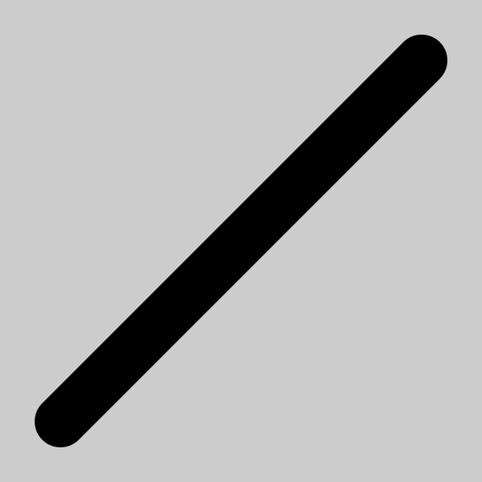 Segment Tool

The Segment Tool is a drawing mode that lets you draw perfectly straight lines.
If you click/tap on one point, drag to another point, and release,
then you get the line segment connecting the two points.
You and others can see the line-segment-in-process as you're doing this.

If you hold <kbd>Shift</kbd>, then
the line segment will be constrained to be horizontal or vertical.
If you hold <kbd>Alt</kbd> or <kbd>Option</kbd> on Mac, then
the line segment will be centered at the first point and have the second point
as one endpoint; the other endpoint is its reflection through the first point.
You can use both modifiers at once,
and you can play with these toggles while you're drawing a line.
(This behavior matches Adobe Illustrator.)

### 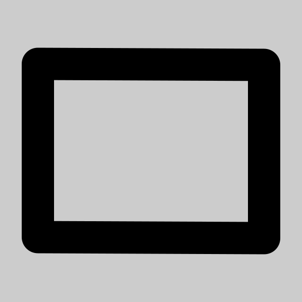 Rectangle Tool

The Rectangle Tool is a drawing mode that lets you draw perfect
axis-aligned rectangles (or squares).
If you click/tap on one point, drag to another point, and release,
then you get the rectangle with those two points as opposite corners.

If you hold <kbd>Shift</kbd>, then
the rectangle will be constrained to be a square (1:1 aspect ratio).
If you hold <kbd>Alt</kbd> or <kbd>Option</kbd> on Mac, then
the rectangle will be centered at the first point and have the second point
as one corner; the opposite corner is its reflection through the first point.
You can use both modifiers at once to draw a square centered at a point,
and you can play with these toggles while you're drawing a rectangle.
(This behavior matches Adobe Illustrator.)

### 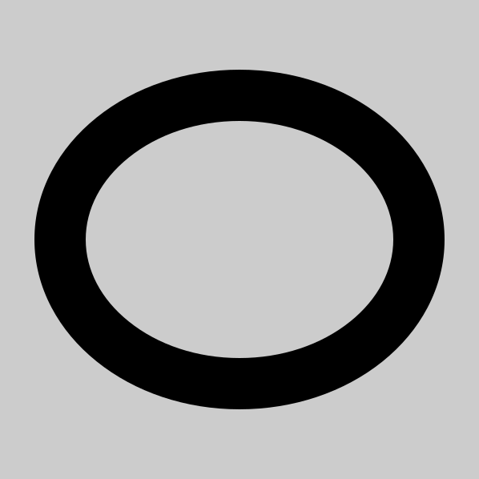 Ellipse Tool

The Ellipse Tool is a drawing mode that lets you draw perfect
axis-aligned ellipses (or circles).
If you click/tap on one point, drag to another point, and release,
then you get the ellipse inscribed in the axis-aligned rectangle
having those two points as opposite corners.

If you hold <kbd>Shift</kbd>, then
the ellipse will be constrained to be a circle (1:1 aspect ratio).
If you hold <kbd>Alt</kbd> or <kbd>Option</kbd> on Mac, then
the ellipse will be centered at the first point and have the second point
as one bounding-box corner.
You can use both modifiers at once to draw a circle centered at a point,
and you can play with these toggles while you're drawing an ellipse.
(This behavior matches Adobe Illustrator.)

###  Erase Tool

The Erase Tool is a drawing mode that erases/deletes previously drawn objects.
Like the
[ Select Tool](#-select-tool),
if you hover over an object (with mouse or pen),
you will see it "highlight" in the form of a shadow.
If you then click/tap, you will erase that object
(and only that object, if you don't move before releasing).
Alternatively, you can click/tap and hold, and drag over multiple objects
to erase them all once.
(Currently you need to drag somewhat slowly over the objects to erase
or you might miss them.)

###  Text Tool

The Text Tool is a drawing mode that lets you type text and mathematical
formulas.  Click/tap on a blank area of the page to start a new text object,
or on an existing text object to edit its text.
(Like the
[ Select Tool](#-select-tool),
if you hover over a text object with mouse or pen,
you will see it "highlight" in the form of a shadow.)
Then you will get a text entry field near the bottom of the screen,
and you can start typing.
You (and everyone) will immediately see your text rendered on the page as well.

You can use basic Markdown syntax to style your text:

* `*italic*` renders as *italic*.
* `**bold**` renders as **bold**.
* `***bold***` renders as ***bold italic***
  (Github-Flavored Markdown extension).
* ``` `code` ``` renders as `code`.
* `~~strike~~` renders as ~~strike~~
  (Github-Flavored Markdown extension).
* To avoid these behaviors, escape the special characters with `\`.
  For example, `\*normal\*` renders as \*normal\*.

You can use LaTeX syntax `$...$` or `$$...$$` to write formulas.
For example: `$e^{i \pi} + 1 = 0$` or `$$\int_0^1 {dx \over x}$$`.

To write multiple lines of text, add manual line breaks via the
<kbd>Enter</kbd> key.  As an exception, line breaks are ignored
within math mode: any math within `$`s renders on a single line,
even if it contains newlines.

When you're done typing in a text object, press the <kbd>Escape</kbd> key.
This won't deselect the object, but it will defocus the text entry field,
allowing you to press other keyboard shortcuts to use other tools.

Cocreate does its best to handle multiple people editing the same text object, but
it won't be perfect: if two people type changes at exactly the same time,
one of their changes will get lost.

### 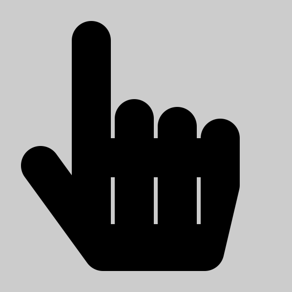 Touch Toggle

This button toggles whether Cocreate will allow drawing via touchscreen.
By default, this toggle is on (the button is down) and it will.
But if you're using a pen-enabled device and want to ignore your palm
resting on screen, then you can toggle it off.  When off,
touch will work only for clicking buttons and in nondrawing modes:
[ Pan](#-pan-tool)
and
[ Select](#-select-tool).

### 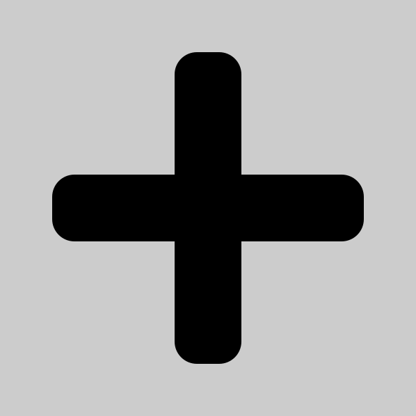 Crosshair Toggle

This button toggles whether to use a simple crosshair for the mouse cursor,
instead of the default behavior of using an icon in the shape of the tool
itself.  The crosshair might be preferable for aiming the mouse precisely.

But mostly this feature is a workaround for
[a bug in Chrome 86](https://bugs.chromium.org/p/chromium/issues/detail?id=1138488#c4)
that will cause drawing to be in the wrong place relative to an SVG cursor
(if your display is scaled),
meaning that Chrome 86 will draw correctly with the crosshair cursor
but not with the fancy tool-specific cursors.
Cocreate therefore turns on the crosshair option automatically
if you're using Chrome 86, unless you've turned it off explicitly
(e.g., because you're not using a scaled display).

### 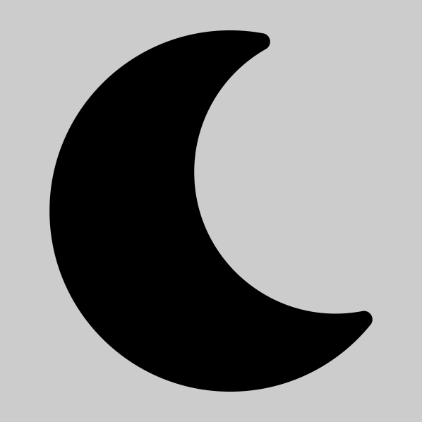 Dark Mode Toggle

This button toggles "dark mode", which uses a dark background and flips dark
and light colors, roughly preserving hue and contrast.
Dark mode is useful if you have light sensitivity or are in a dark room.

This toggle affects only your view, not others' views, so one user can be in
(default) light mode while another user is in dark mode,
and they see roughly the same diagram.
Dark mode approximately preserves the hue of colors, but the brightness is
inverted, so one user's "bright blue" is another user's "dark blue".
As a warning, reds and purples currently look somewhat similar in dark mode.

###  Grid Toggle

This button toggles whether the current page has a square grid like graph paper.
(Currently, the grid cannot be configured.)
This change affects everyone, but it affects only the current page.

When you create a
[ New Page](#-new-page),
it has a grid or not according to the current page.

### 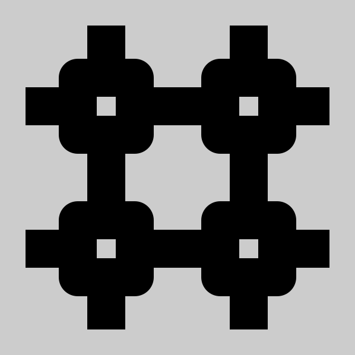 Grid Snap Toggle

This button toggles "snapping" geometry to the grid (the same grid drawn by
the [ Grid Toggle](#-grid-toggle)).
[ Segments](#-segment-tool),
[ Rectangles](#-rectangle-tool), and
[ Ellipses](#-ellipse-tool)
will have their defining points rounded to the nearest grid point.
The [ Pen Tool](#-pen-tool)
is unaffected by grid snapping.

[ Selecting](#-select-tool)
and dragging objects will move by multiples of grid squares.
This can be useful in combination when duplicating objects, which shift
by exactly one grid dimension down and right, so you can use grid-snapped
dragging to get them back into perfect alignment with the original.
Selecting objects (by clicking on them or dragging a rectangle)
is unaffected by grid snapping.

###  Copy Link

This button copies a link to this Cocreate room/board to your clipboard.
You can then share the link with others by pasting the link into your
favorite messaging platform (e.g., email).

### 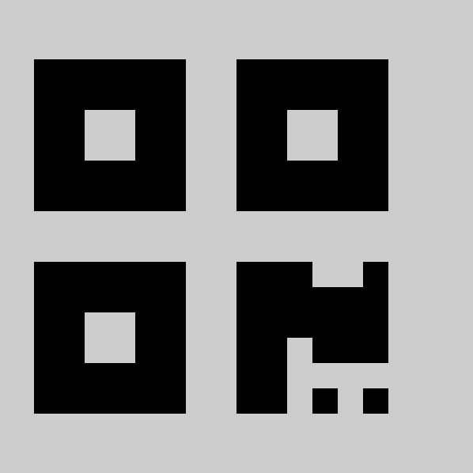 QR Code

This button displays a QR code for the current room.
You can then navigate to the link from a device with a camera and QR code reader,
for example most mobile phones or tablets.

###  New Room

This button creates a new Cocreate room/board, with a new URL,
in a new browser tab.  You can achieve the same effect by removing the
last part of the URL (`r/gLoBaLlYuNiQuEiD7`), but this button saves that work.

###  Time Travel

Time Travel is a toggling mode that lets you look at the history of past
versions of the current page.
It replaces the attribute palette at the bottom of the window
with a slider which starts at the far left (the beginning of time).
As a result, you'll see a blank screen.
By dragging the slider to different points in the timeline,
you'll see the evolution of the page.

While in Time Travel mode, you can do the following:

* Use the
[ Undo /  Redo](#-undo---redo)
buttons to take single steps backward or forward in the timeline.
* Drag on the page to pan around (like the
[ Pan Tool](#-pan-tool)),
or pan using a scroll wheel or touchpad pan gesture.
* [ Zoom Out /  Zoom In](#-zoom-out---zoom-in)
using the buttons, using a scroll wheel while holding
<kbd>Ctrl</kbd>, or using a touchpad zoom gesture.
* [ Zoom Reset](#-zoom-reset) or [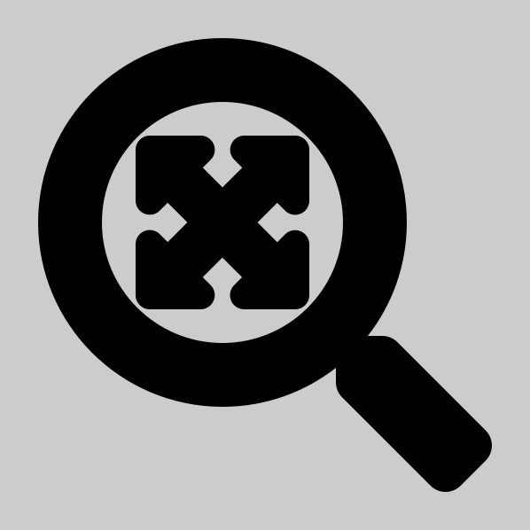 Zoom To Fit](#-zoom-to-fit).
* [ Download SVG](-download-svg) for the currently viewed version.

The tool palettes switch to a sepia tone to indicate you're time traveling.
You can't make any changes or see others' cursors while time traveling.
You can leave Time Travel mode by clicking
 Time Travel
again, or by selecting another mode from the left palette.

###  Download SVG

This button exports either the current selection or the entire current page to
[SVG format](https://en.wikipedia.org/wiki/Scalable_Vector_Graphics)
and downloads it as an `.svg` file.
SVG should perfectly reproduce the page in full vector quality, including
the text and mathematics, though the text may require a font download.

If you're using the
[ Select Tool](#-select-tool)
(or beware, the
[ Text Tool](#-text-tool)),
and have one or more objects selected, then the SVG file will include just
those objects.
This is useful for exporting one subfigure from a sprawling whiteboard:
just drag a rectangle to span the part you want, and fine-tune by
shift-clicking individual objects you want or don't want.
If no objects are selected (e.g. you're using any other tool),
you get the entire page.

The downloaded file is named `cocreate-gLoBaLlYuNiQuEiD7.svg`
where the second part is the unique ID of your room.
This way, if you lose the link to the Cocreate room, you can figure it
out from the filename.  But be careful not to accidentally leak it to someone
you don't want to by sending them the file with its original name.

###  Github Link

This button opens a new browser tab with Cocreate's
[Github page](https://github.com/edemaine/cocreate/) where you can
[read this documentation](https://github.com/edemaine/cocreate/blob/master/doc/README.md),
[read the source code](https://github.com/edemaine/cocreate/), and
[report bugs and request features](https://github.com/edemaine/cocreate/issues).

### 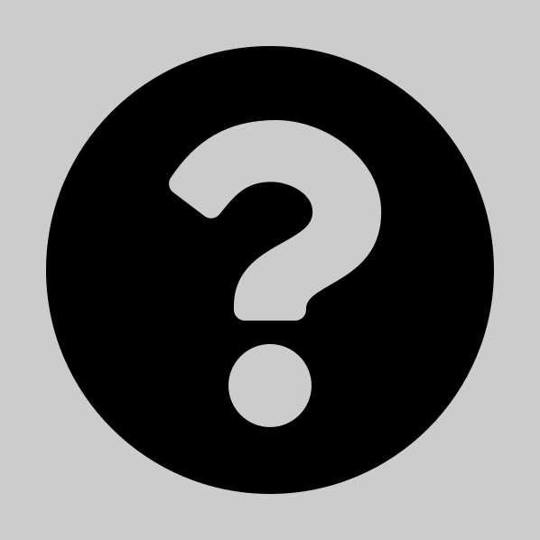 Help Link

This button opens a new browser tab with
[this User Guide](https://github.com/edemaine/cocreate/blob/master/doc/README.md).
Perhaps it's how you got here?

## Page Tools (top palette)

Each Cocreate board can have multiple pages, ordered 1, 2, ...
You start on page 1, but can freely add more pages.
(You currently cannot delete pages, however.)
For example, you might start a new page
when you want to start a fresh idea, problem, etc.
It's also a good idea, for higher performance, to use more pages
with less information on them.

### Manual Page Number Entry

To jump to a distant page, you can edit the page number (before "of").
Press <kbd>Enter</kbd> when you've finished typing.

###  Previous / 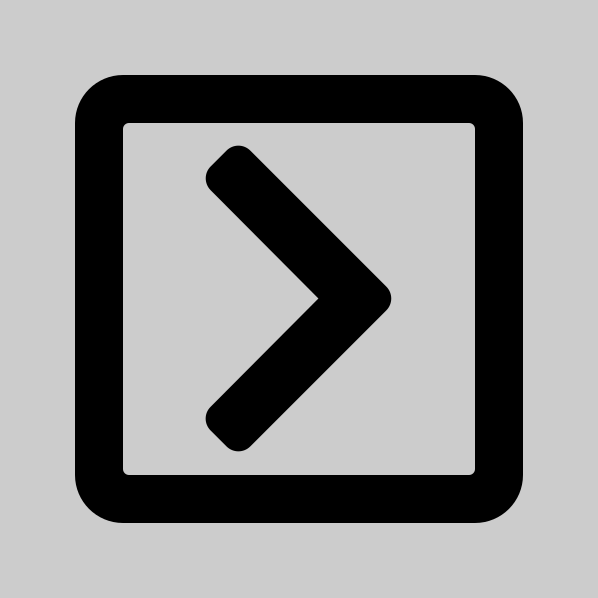 Next Page

These buttons navigate your view to the previous or next page.
They affect only your view, not other users.
If you're meeting with others, communicate what page you're looking at.

###  New Page

This button creates a new blank page immediately after the current page,
and goes to that page.  If you were on page 6, this button will create and
go to a new blank page 7, shifting all later pages up in page number.

###  Duplicate Page

This button duplicates the current page into a new page immediately after,
and goes to that new page.  If you were on page 6, this button will create and
go to a new page 7 with the same objects as page 6 (but without the history
of changes), shifting all later pages up in page number.

###  Zoom Out /  Zoom In

These buttons change your view of the current page, zooming out or in by 20%.
They affect only your view, not other users.
Click/tap a button multiple times to zoom out/in more.

Each zoom operation is relative to the center of your current view.
So if you want to zoom on something specific,
[ Pan](#-pan-tool)
to put it in the center of your view, and then
 Zoom In.

You can also zoom using a scroll wheel while holding <kbd>Ctrl</kbd>,
or using a touchpad's zoom gesture (typically two-finger pinching).

###  Zoom Reset

This button resets the zoom level to 100%, the same as when you first load
Cocreate.  This is helpful if you get lost zooming in or out.

###  Zoom To Fit

This button sets the zoom and pan so that all objects fit inside the display.
This can be useful to get an overall picture of the page, and then
zoom into a part of interest.  In particular, it can help you find
parts of the page that are previously off-screen.

You can also
 Select
a subset of objects and then
 Zoom To Fit
the selection to the screen.

### Your Name

If you type your name into the box in the top right, then your name
will appear next to your cursor on everyone else's screen.
This makes it easy to figure who's drawing and who's pointing at what.
Assuming your browser isn't in "private" mode, your name gets saved by
your browser for future visits, and synchronizes across Cocreate tabs.

If you're using Cocreate in
[Comingle](https://github.com/edemaine/comingle), your name
in Cocreate automatically gets set to your name in Comingle.

## Attribute Tools (bottom palette)

The tools in the bottom palette serve two functions:

* they change the attributes (line width, font size, and color)
  for any objects you'll draw next; and
* they change the attributes of any objects you currently have selected,
  if you're using the
  [ Select Tool](#-select-tool).

If you're using a "nondrawing" tool (any tool that doesn't create objects)
and do not have any objects selected, then clicking/tapping on any of these
attribute tools will switch to the last drawing tool you used (defaulting to
the pen).  The idea is, if you want to go straight to drawing in purple,
you can click/tap on purple and go straight to drawing, without having to
reset your tool.

### Line Width

These buttons control the outline/stroke width of objects with an outline
(anything except text).  Currently, you have seven integral choices.

### Font Size

When you're using the
[ Text Tool](#-text-tool),
the line-width choices are replaced by font-size choices.
These control the size of the entire text object.
Currently, you have seven integral choices.

###  Fill /  No Fill Toggle

This button controls whether objects have a fill color or are hollow
(transparent inside).
Click/tab the button to switch between
 Fill and
 No Fill.
The button's icon will be colored according to the current fill color,
set by <kbd>Shift</kbd>-clicking on a color in the
[Color Palette](#color-palette).

This toggle only affects objects that support fill:
[ Rectangles](#-rectangle-tool)
and
[ Ellipses](#-ellipse-tool).

### Color Palette

These buttons normally control the **outline/stroke** color of objects.
(This includes the color of text objects.)

If you hold down <kbd>Shift</kbd> on your keyboard when choosing a color,
you control the **fill** color of objects that support fill:
[ Rectangles](#-rectangle-tool)
and
[ Ellipses](#-ellipse-tool).
When you choose a fill color, you automatically turn on
[ Fill](#-fill---no-fill-toggle).

The last color button 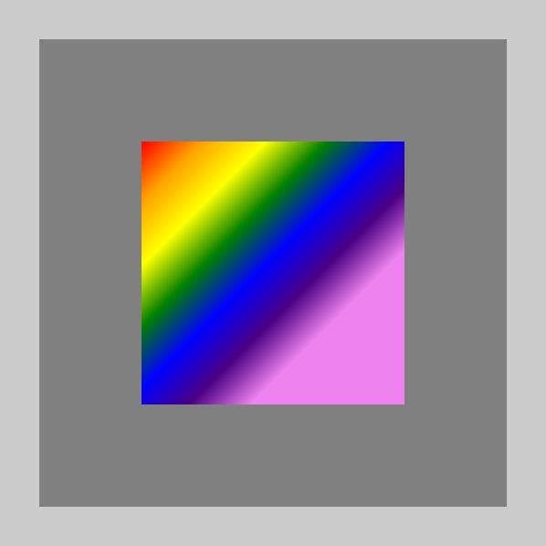
has a rainbow on it, indicating that it can take on any color.
Selecting the rainbow subicon brings up a color selection widget
(dependent on your browser), letting you change the custom color
which is indicated by the colored border around the rainbow.
Selecting the colored border directly lets you choose the same color again
without bringing up the color selection widget.
If you want to match the color of an existing object, use the
[ Select Tool](#-select-tool)
to select just that object, which will set the current attributes
(including custom color) to the attributes of that object.

## Troubleshooting

If something weird is happening in Cocreate, you should check the
JavaScript console for any error messages.
Just follow [these instructions for opening the JavaScript
console](https://webmasters.stackexchange.com/a/77337), and look for
red error messages.

If you think something is wrong with Cocreate, please
[report a bug](https://github.com/edemaine/cocreate/issues).
You can use the same system to request features (but please first check
for an existing request for that feature).
